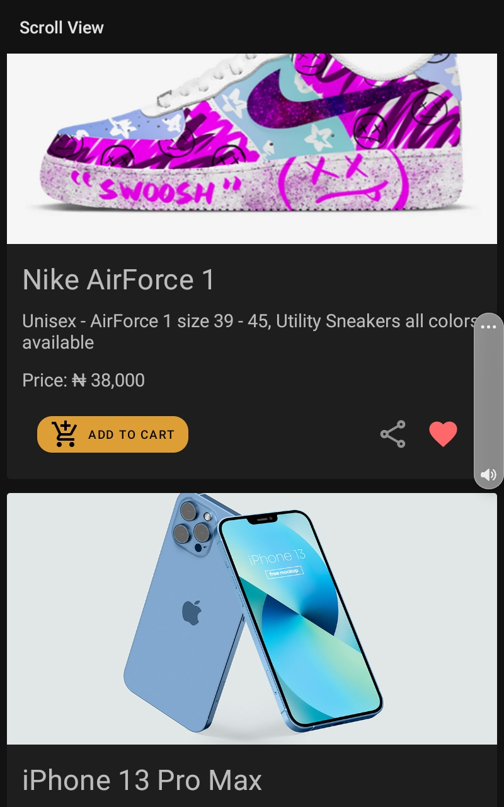
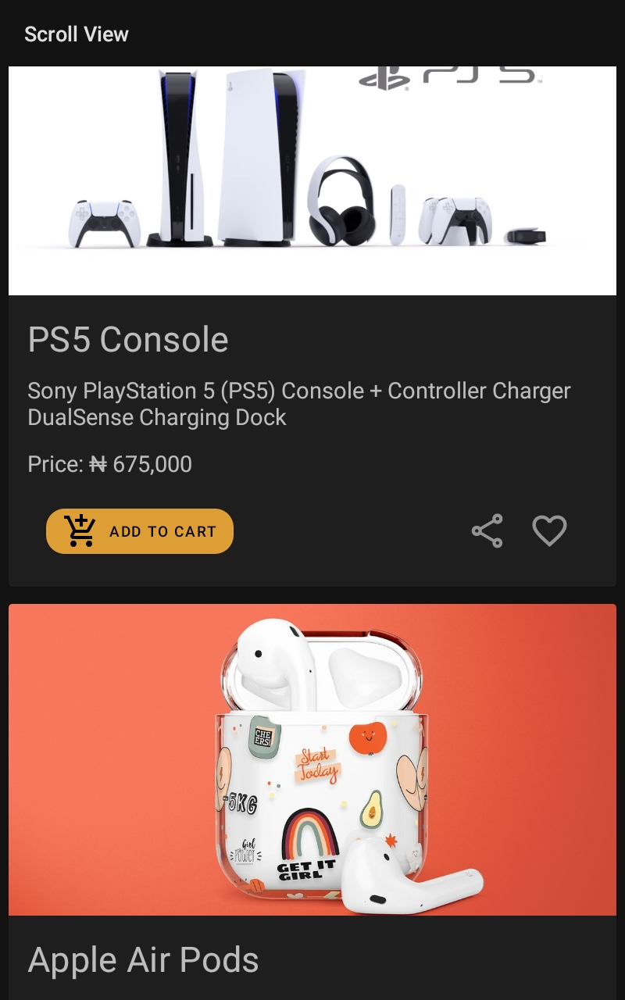
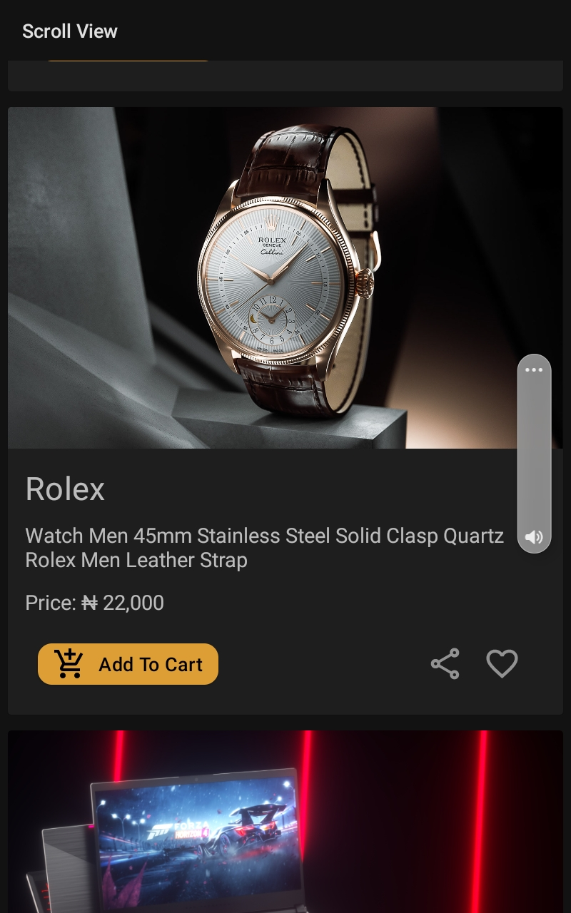

# Practicing Recycler View
Used recycler view to display a scrollable list
## Description
- Displayes the image, a description, price etc for each item 
- I used Cards for each individual item and a Recycler View Widget 
- I also usd a data class to define the structure of each item
- Then a datasource which returns a list of the items
- I added a '**Add to Cart**' button, a '**share**' and a '**like**' button per item
## Note
**This personal project was done after completion of Unit 2: Layouts, Android Basics In Kotlin**

## Screenshots
**Preview 1**
--

**Preview 2**
--

**Preview 3**
--

